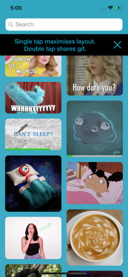

# Giftainer

Giftainer is a gif client with search option which stores gifs locally for a better look up experience. Application enables exporting gifs to social networks or via iMessage. Application uses Core Data, RxSwift and Giphy web api. The main goal of the project is to demonstrate my current programming skills.

## Inspirations

Giftainer implementation is based on some great exisiting concepts:
- Layout code is inspired by Chris Eidhof post: http://chris.eidhof.nl/post/micro-autolayout-dsl/
- Core Data helpers are inspired by objcio implementation: https://github.com/objcio/core-data,
- Notifications implementation is inspired by SwiftTalk by objcio 

## Notes

ViewModels are using RxCocoa to access BehaviorRelay. Related issue is described here: https://github.com/ReactiveX/RxSwift/issues/1501

